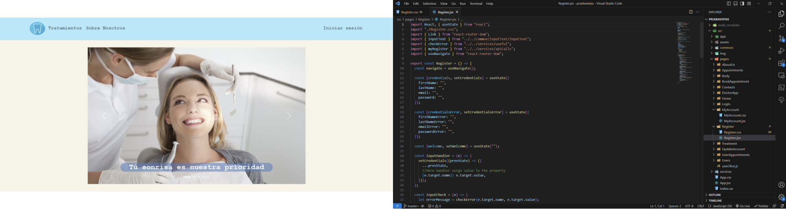
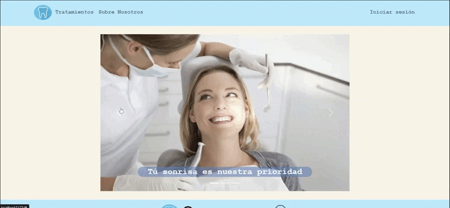
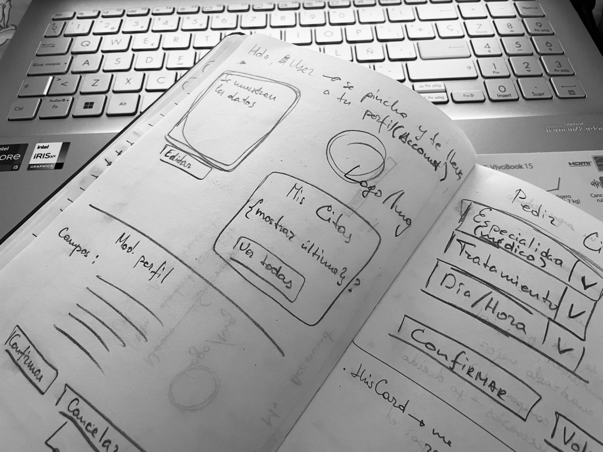

<h1 align="center">Welcome to my Dental Clinic frontend app</h1>

<h1 align="center">Fifth project in Geekshubs Academy FSD 04-2023</h1>



<details>
  <summary>Contet: 📝</summary>
  <ol>
    <li><a href="#target">Target</a></li>
    <li><a href="#about-the-project">About the project</a></li>
    <li><a href="#stack">Stack</a></li>
    <li><a href="#installation">Installation</a></li>
    <li><a href="#development ">Project structure</a></li>
    <li><a href="#endpoints">Endpoints</a></li>
    <li><a href="#future-functionalities">Future functionalities</a></li>
    <li><a href="#license">License</a></li>
    <li><a href="#acknowledgments">Acknowledgments</a></li>
    <li><a href="#contacts">Contacts</a></li>
  </ol>
</details>

## Target
On this occasion the requirement was to generate a front-end that connects with
our API that manages the business model of a dental clinic.

## About the project
<p aling="center"></p>
The purpose was to build a front-end of the app
with logical and comfortable use, in order that users, professionals and an administrator can access it and be enabled to perform various tasks with access that each one has. All this connected with the backend of the previous project, so we would have a fully functional app.

## Stack
<div align="center">
<a href="https://www.reactjs.com/">
    
</a>
<a href="https://developer.mozilla.org/es/docs/Web/JavaScript">
    
</a>
 <a href="https://redux.js.org/">
    
</a>
<a href="https://react-bootstrap.github.io/">
    
</a>
<a href="https://nodejs.org/en">
    
</a>
<a href="https://github.com/">
    
</a>
<a href="https://git-scm.com/downloads">
    
</a>
<a href="https://developer.mozilla.org/es/docs/Web/CSS">
    
</a>
<a href="https://nextjs.org/">
    
</a>
<a href="https://expressjs.com/">
    
</a>
<a href="https://www.sequelize.org/">
    
</a>
<a href="https://www.npmjs.com/">
    
</a>

 
</div>

## Installation

you can test the application by following these steps:
 Clone the project on your computer
    ` $ git clone 'url-repository' `
 Install all dependencies
    ` $ npm install `
 Create a .env with the credentials on the .env.example
 Start server with:
   ``` $ npm run dev ```
 Connect with the database following:
    ``` $ npx sequelize-cli db:create ```
    ``` $ npx sequelize-cli db:migrate ```
    ``` $ npx sequelize-cli db:seed:all ```
Now is time for frontend project:
 Clone the project on your computer
    ` $ git clone 'url-repository' `
 Install all dependencies
    ` $ npm i `
 Start server with:
   ``` $ npm run dev ```
Last step download the dataBase:
[Data base Git-Hub](https://github.com/AnastasiaKosovets/ak-fsd-backend-dentalClinic)

## Development 

The first thing to start the project was to have clear the layout of the application. Based on the previously done back-end work, the creation of views was easier and more intuitive. I had to make an outline of all the access points - executions that my app would have to perform and then calculate the actual time it will take me to implement it.




## Endpoints

#### Currently the following actions can be performed in this app:
- Login
- Register
- Logout
- My Profile (for each role)
- Access to personalize your personal data (from My Profile)
- Access to your appointments (from My Profile)
- Book appointment (from My Profile or Navbar)
- Home page
- View of treatments
- View of the clinic's doctors
- View of all users (by Admin) 
- View of all appointments (by Admin and Doctor)
- View of My Appointments (by Doctor)
- Acces to cancel Appointment (by token)
- Contacts view

## Future functionalities

If I could devote more time to develop this project, I would have liked to implement more functionalities, like being able to modify your appointment (not only cancel), implement more security of the application itself, create a "contact us" form and be able to practice the detail view function for users and appointments.

## Licencia
This project is belonging to license Creative Commons Legal Code.
 

## Acknowledgments:

I thank my teachers for their time dedicated to this project:

- ***Dani***  
<a href="https://github.com/Datata" target="_blank"></a> 

- ***Jose***  
<a href="https://www.github.com/JoseMarin" target="_blank"></a>

- ***David***  
<a href="https://www.github.com/Dave86dev" target="_blank"></a>

- ***Mara***  
<a href="https://www.github.com/MaraScampini" target="_blank"></a> 

## Contacts
<a href = "mailto:anastasiakosovets@gmail.com"></a>
<a href="https://www.linkedin.com/in/anastasia-kosovets-00022917b/" target="_blank"></a> 
</p>